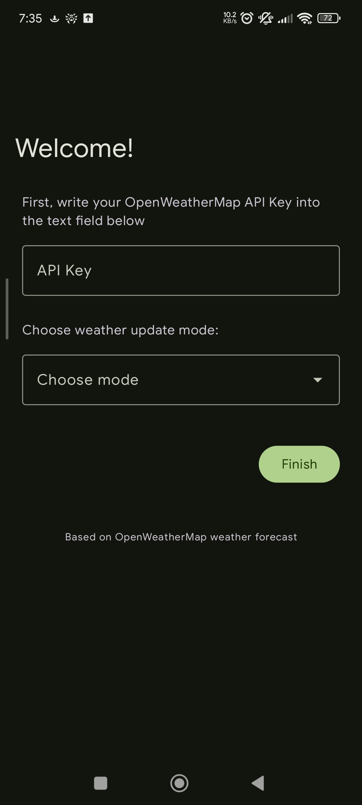
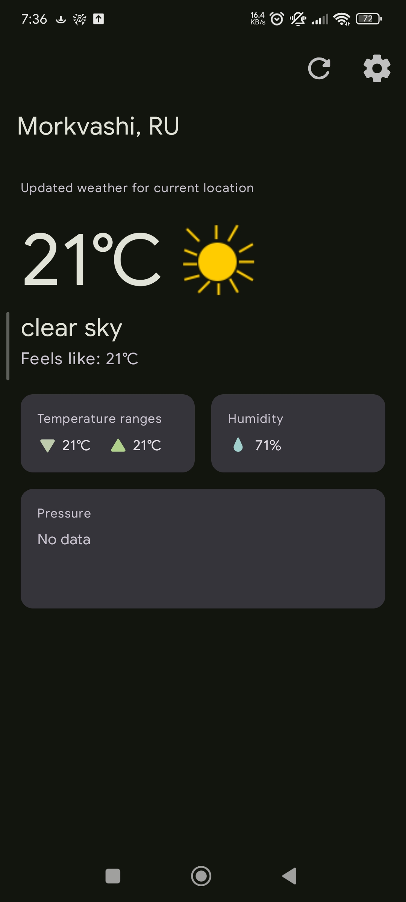

# Weather Forecast

  
  
  
  
  
  

  <b>A modern, lightweight Android application to check weather forecasts, fully tailored with dynamic Material You styling.</b>

---

## Screenshots

  <!-- Замените ссылки ниже на реальные скриншоты, когда загрузите их в свой репозиторий -->
    

## Tech Stack & Specifications

* **OS & Hardware Compatibility:**

  <table>
    <tr>
      <td><b>OS Version</b></td>
      <td></td>
    </tr>
    <tr>
      <td><b>Architecture</b></td>
      <td></td>
    </tr>
  </table>

* **SDK Configuration:** 
   
   
  

* **Technologies Used:** 
   
  

---

## Features & Stability

* [x] **Crash-free:** Fixed critical app crash after opening the application several times.

* [x] **Dynamic Themes:** Full support for Material You palette based on user's wallpaper.

## Supported languages

 * English (default)

 * Russian (ru)

## Roadmap & Tasks

* [ ] Add more detailed weather information on the main page (wind (WIP), humidity (done), pressure (WIP)).

* [ ] Add Settings page. (WIP)

* [ ] Implement in-app updates check.

* [x] **Fix Back Button:** Call `finish()` in `FirstRunActivity` after routing to prevent returning to the onboarding/splash screen.
